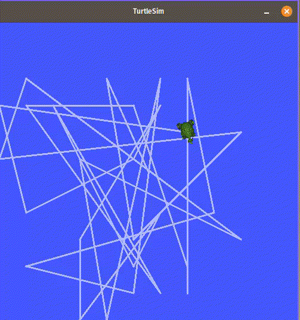

# My ROS2 project with TurtleSim 

The main idea is simple: 
You have your main turtle, and some another turtle which spans in random time. You'r turtle like pacman need to touch another turtles to destroy them.

